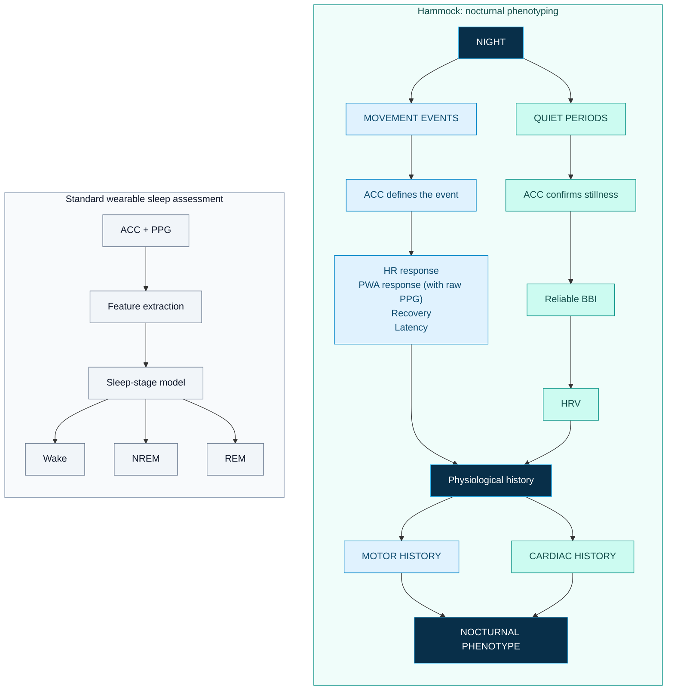

<p align="center">
  
</p


[](https://github.com/marcellosicbaldi/OvernightAccelBbi/actions/workflows/python-tests.yml)
[](https://github.com/marcellosicbaldi/OvernightAccelBbi/releases)

# Hammock

**Consumer-grade wearables (Apple Watch, Whoop, Oura, Garmin, ...) describe sleep using categories such as awake, light sleep, deep sleep, and REM.**

These categories come from **polysomnography (PSG)**, the clinical gold standard for studying sleep, which uses brain activity and other neurophysiological signals to define sleep stages. But wrist wearables do not directly measure these signals.

So, why should we fit those signals (that, by the way, are not even recorded by PSG) into PSG-defined boxes?

Instead of asking:

> *Can a wearable reproduce PSG sleep stages?*

this project asks:

> **What can we measure directly and reliably from accelerometry and photoplethysmography during sleep?**

## Two ways to describe the night



ACC = accelerometry; PPG = photoplethysmography; BBI = beat-to-beat interval;
HRV = heart rate variability; PWA = pulse-wave amplitude. PWA responses are a
potential extension requiring raw PPG, which the current Garmin recorder does not collect.

## A different view of the night

The framework separates the night into two physiological conditions:

### Movement events

Accelerometry identifies nocturnal movements and quantifies their timing, duration and intensity. Around each movement, cardiac signals can be used to characterize the associated heart rate (HR) response:

**movement → HR response → peak → recovery**

With raw PPG, this can potentially be extended to pulse-wave amplitude and other vascular features. During movements, HRV cannot be extracted reliably due to motion artifacts. Rather than forcing HRV estimates where signal quality is poor, the movement itself becomes the event of interest.

### Quiet periods

When the wrist is still and beat-to-beat intervals are reliable, the same signals can be used to characterize autonomic regulation:

**quiet period → BBI → HRV**

This allows the night to be described through both:

**Motor history** — when and how the body moved

**Cardiac history** — autonomic state during quiet periods and cardiovascular responses to movement

## From sleep staging to nocturnal phenotyping

The goal is not to replicate PSG on the wrist. The goal to extract physiological metrics that can be actually measured by wrist-wearables:

- movement burden and intensity
- cardiovascular reactivity to movement
- response and recovery dynamics
- quiet-period HRV
- motor–cardiac coupling
- within-person changes over time

Together, these signals may define **new nocturnal phenotypes** designed for continuous, real-world monitoring rather than for reproducing laboratory sleep staging.

---


## Get started with the analysis

Use **Python 3.12**. From a terminal:

```sh
git clone https://github.com/marcellosicbaldi/OvernightAccelBbi.git
cd OvernightAccelBbi
python -m venv .venv
```

Activate the environment (`.venv\Scripts\Activate.ps1` in Windows PowerShell,
or `source .venv/bin/activate` on macOS/Linux), then install:

```sh
python -m pip install -r offline_processing/requirements-notebooks.txt
```

Copy `offline_processing/paths.example.json` to
`offline_processing/paths.local.json` and set the paths to your own FIT recording
and diary. Relative paths resolve against `offline_processing/`. Local paths and
recordings are ignored by Git. Environment variables `OVERNIGHT_FIT_PATH`,
`OVERNIGHT_REORIENTATION_FIT_PATH`, and `OVERNIGHT_DIARY_PATH` can override the file.

Launch Jupyter from the repository root:

```sh
python -m jupyterlab
```

- Start with [load_fit_test.ipynb](offline_processing/load_fit_test.ipynb) for
  recording inspection, diary cropping, bursts, recorded-HR responses, and HRV.
- Use [wrist_reorientation_hr.ipynb](offline_processing/wrist_reorientation_hr.ipynb)
  for exploratory wrist-orientation comparisons. This notebook uses HR derived
  from BBI callbacks; the main notebook uses FIT-recorded HR for event responses.
- The diary workbook needs `Date`, `lightsoff`, and `wakeup` columns. `Date` is the
  date of lights off, including after-midnight entries. The interval is time in
  bed, not independently confirmed sleep.

The main notebook uses the adapted **GP_pipeline** HRV workflow: quiet segments
of 1-5 minutes, 5-minute windows with 1-minute steps for longer segments,
single-pass artifact classification, and linear interval cleaning. Raw BBIs,
repairs, and excluded windows remain inspectable. See
[HRV method, defaults, and provenance](docs/HRV_PIPELINE.md) for the Garmin adaptations.

Personal FIT files, diaries, saved notebook outputs, and derived health data are
not distributed. Running a full notebook requires your own compatible recording;
the regression tests use synthetic inputs and need no personal dataset.

To inspect BBI recovery without a notebook:

```sh
python offline_processing/fit_bbi.py path/to/recording.fit
```

## Watch app

The current targets are **Garmin Instinct 3 AMOLED 45 mm and 50 mm**, with Connect IQ
API level 5.1.0 or later. Recorder firmware is **v1.1.1**.

Install the Garmin Connect IQ SDK and use your own developer signing key. On Windows:

```powershell
.\scripts\build.ps1 -SdkPath 'C:\path\to\connectiq-sdk' -KeyPath 'C:\path\to\developer_key'
```

The build script also reads `GARMIN_SDK_HOME` and `GARMIN_DEVELOPER_KEY`, and can
discover the SDK selected in SDK Manager. Source releases do not include signed
binaries. See [build, installation, and FIT schema documentation](docs/WATCH_APP.md)
for recording controls, sideloading, and device checks.

## Interpretation and current limits

- SensorLogger controls native FIT acceleration sampling; the 25 Hz callback
  request is separate. Approximately 100 Hz has been observed in local recordings,
  but every input needs timing and unit checks.
- Acceleration values may need explicit mg-to-g conversion despite their FIT unit
  labels. The main notebook currently uses a **40 mg** burst threshold; the
  reorientation notebook uses **20 mg**. Neither threshold is validated here for
  this Garmin pipeline.
- The current shared HR analysis uses **-20 through +49 s** around onset and a
  **15-s baseline [-20, -5)**. These are adaptations of the reference paper's
  shorter epoch and baseline. Both notebooks require 30-second gaps between
  movements and exclude subsequent movements anywhere through +49 s.
- BBI callback arrival times are approximate; they are not exact beat timestamps.
  Complete recovery of delivered intervals does not prove complete physiological
  beat coverage, normal-to-normal intervals, or a verified sensor source.
- HRV cleaning and quality screens are exploratory for Garmin BBIs. GP defaults
  ignore movements shorter than 2 s when forming quiet periods and impose no
  repair-fraction cutoff; inspect the reported repairs. Window durations vary
  and overlapping windows are not independent. PIP counts zero successive
  differences; quantization and interpolation can affect it.
- Wrist reorientation is not whole-body sleeping position. Movement-free periods
  are not necessarily sleep. The pipeline does not diagnose disorders or classify
  sleep stages.
- Device battery/storage use and coexistence with native sleep tracking need
  device-specific evaluation. No raw ECG or PPG waveform is recorded by this app.

## Development and versions

```sh
python -m unittest discover -s offline_processing -p "test_*.py" -v
```

GitHub Actions runs the Python suite and checks that published notebooks contain
no executed outputs. Python checks do not replace simulator or physical-watch
validation. See [contributing](CONTRIBUTING.md), the [changelog](CHANGELOG.md),
and the [Night Explorer roadmap](docs/ROADMAP.md).

Repository release **v0.1.0** is the first public source snapshot and includes
recorder firmware **v1.1.1**. Earlier local development is not reconstructed as
Git history. Subsequent changes will be tracked through commits, issues, and releases.

## Research context

The movement and cardiac-response workflow draws on:

Sicbaldi et al., *Mapping the physiological landscape of body movements during
nocturnal sleep and wakefulness and their cardiovascular correlates with a wearable
multi-sensor array*, Scientific Reports.
[Read the paper](https://doi.org/10.1038/s41598-025-29723-7).

This single-wrist implementation includes adaptations and requires its own validation.
Heart-rate fragmentation is informed by
[Costa et al. (2017)](https://doi.org/10.3389/fphys.2017.00255).

Created by [Marcello Sicbaldi](https://github.com/marcellosicbaldi).
